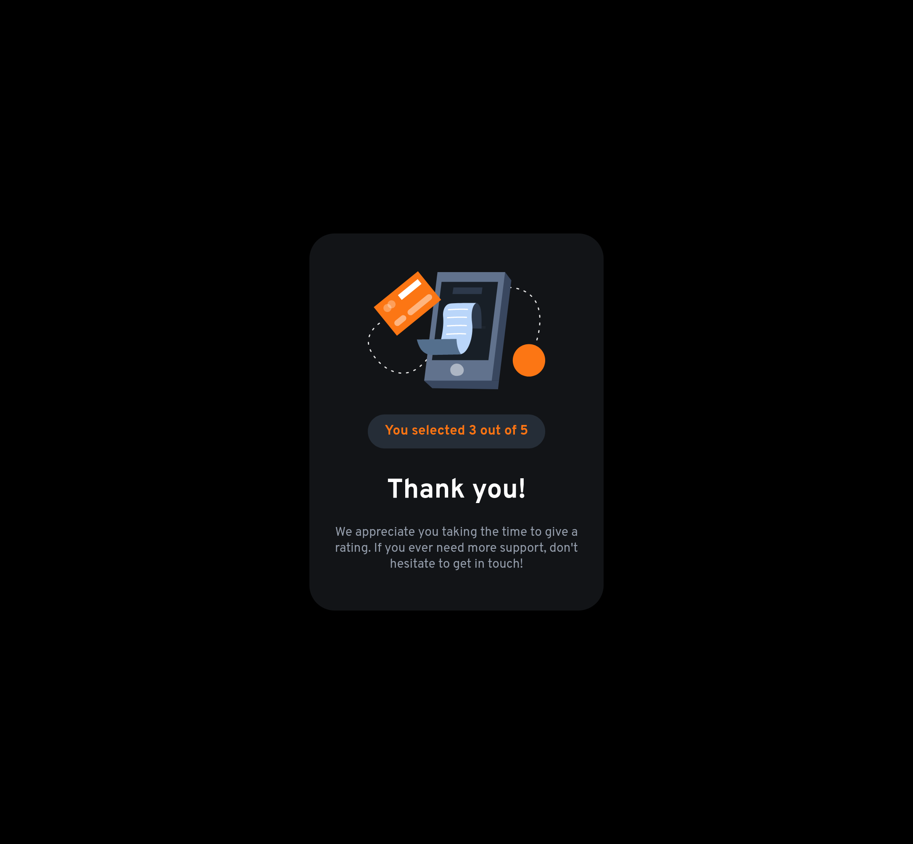

# Frontend Mentor - Interactive rating component solution

This is a solution to the [Interactive rating component challenge on Frontend Mentor](https://www.frontendmentor.io/challenges/interactive-rating-component-koxpeBUmI). Frontend Mentor challenges help you improve your coding skills by building realistic projects. 

## Table of contents

- [Overview](#overview)
  - [The challenge](#the-challenge)
  - [Screenshots](#screenshots)
  - [Links](#links)
- [My process](#my-process)
  - [Built with](#built-with)
  - [What I learned](#what-i-learned)
  - [Continued development](#continued-development)
  - [Useful resources](#useful-resources)
- [Author](#author)

## Overview

### The challenge

Users should be able to:

- View the optimal layout for the app depending on their device's screen size
- See hover states for all interactive elements on the page
- Select and submit a number rating
- See the "Thank you" card state after submitting a rating

### Screenshots





### Links

- Solution URL: [GithHub Repository](https://github.com/danielrsouza10/Interactive-rating-component)
- Live Site URL: [Interactive Ratingg Component](https://danielrsouza10.github.io/Interactive-rating-component/)

## My process

### Built with

- Semantic HTML5 markup
- CSS custom properties
- Flexbox
- Javascript

### What I learned

Got familired with new tags like <svg> and the particularities to style it with (or without) CSS3.
Feeling more confortable using Events and the manipulation of the DOM with JavaScript.

```html
 <svg width="50" height="50" style="background: hsl(216, 12%, 8%)">
            <svg x="0" y="0">
              <circle cx="25" cy="25" r="25" style="fill: hsl(213, 19%, 18%)" />
              <svg width="17" height="16" x="17px" y="17px" xmlns="http://www.w3.org/2000/svg">

                <path id="path"
                  d="m9.067.43 1.99 4.031c.112.228.33.386.58.422l4.45.647a.772.772 0 0 1 .427 1.316l-3.22 3.138a.773.773 0 0 0-.222.683l.76 4.431a.772.772 0 0 1-1.12.813l-3.98-2.092a.773.773 0 0 0-.718 0l-3.98 2.092a.772.772 0 0 1-1.119-.813l.76-4.431a.77.77 0 0 0-.222-.683L.233 6.846A.772.772 0 0 1 .661 5.53l4.449-.647a.772.772 0 0 0 .58-.422L7.68.43a.774.774 0 0 1 1.387 0Z"
                  fill="#FC7614" />
              </svg>
            </svg>
```
```css
.rating-circle {
    margin: 10px 0 10px 0;
    height: 50px;
    width: 50px;
    border-radius: 50%;
    background-color: hsl(213, 19%, 18%);
    display: flex;
    align-items: center;
    justify-content: center;
}
```
```js
rating.addEventListener('click', function(e){
    e.target.style.background = 'gray';
    choose = e.target.innerText;
    console.log(choose);
});

submit.addEventListener('click', function (e){
    youSelected.textContent = "You selected " + choose + " out of 5";
    thankYouImg.appendChild(youSelected);
});
```

### Continued development

Now I will search for more ways to manipulate the DOM so I can turn what the HTML will show (or not show) when some events occurred in the page.
Need some research about Grid so I can structure the HTML and CSS with it.

### Useful resources

- [The Odin Project](https://www.theodinproject.com) - This helped me for DOM Manipulation.

## Author

- Website - [Linkedin](https://www.linkedin.com/in/danielrsouza/)
- Instagram - [@danielrsouza](https://www.instagram.com/danielrsouza)
